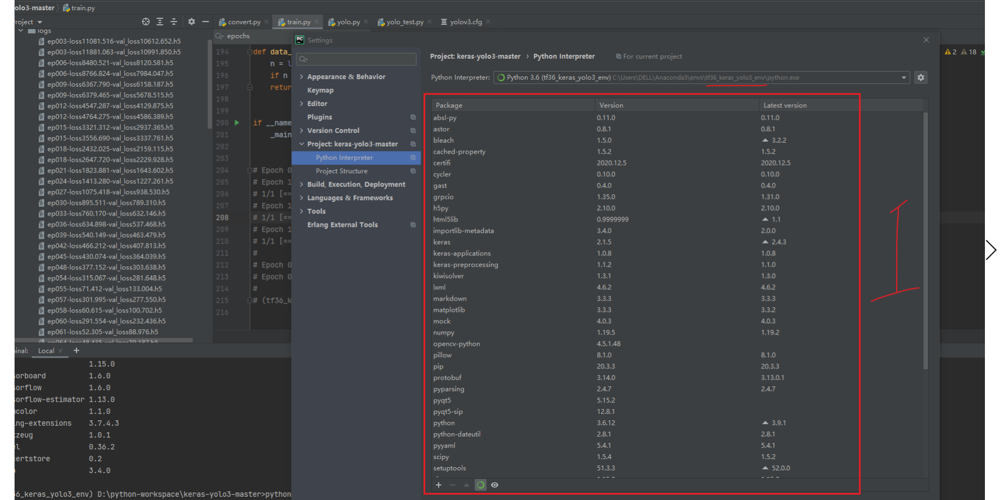
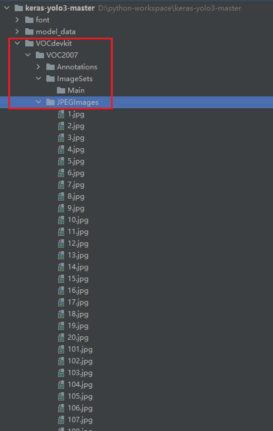
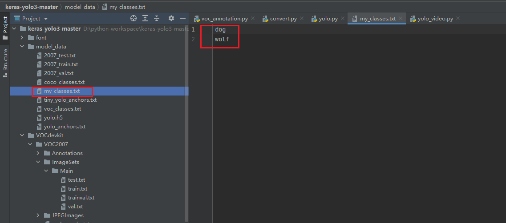
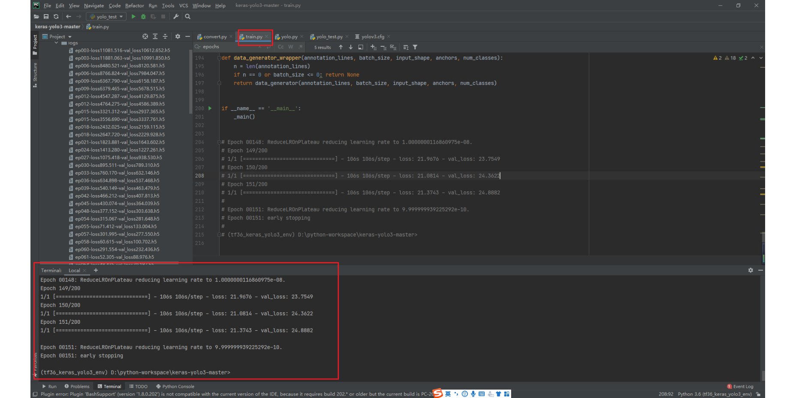
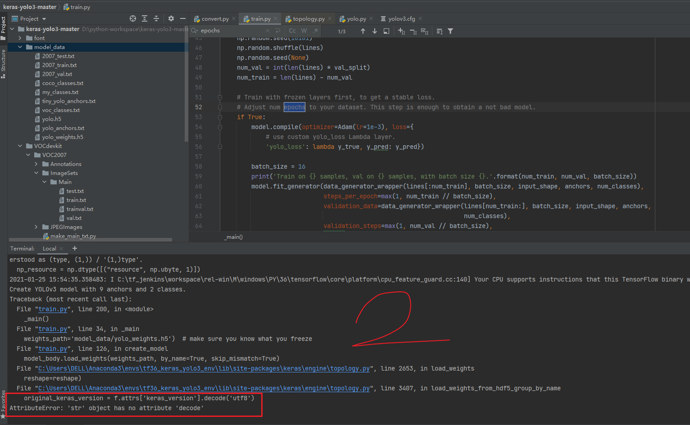

# keras-yolo3-master
基于Keras-yolo3训练自定义目标检测模型，本地win10，cpu环境调试通过。（文档配有详细的开发步骤可供参考）

Keras-yolo3训练自定义模型步骤
参考资料：
【AI实战】动手训练自己的目标检测模型（YOLO篇）：
https://my.oschina.net/u/876354/blog/1927881
（keras）yolov3特定目标检测&自己图片做训练集：https://blog.csdn.net/mingqi1996/article/details/83343289
EddyGao/make_VOC2007：
https://github.com/EddyGao/make_VOC2007/blob/master/make_main_txt.py
【YOLOv3】YOLO3训练自己的单类model：
https://blog.csdn.net/davidlee8086/article/details/79693079
ImportError: `save_model` requires h5py.：
https://blog.csdn.net/qq_28454857/article/details/84029250 

注意：所有路径不可有中文和特殊符号

1.下载代码 ：
https://github.com/junlintianxiatjm/keras-yolo3-master

2.安装虚拟环境：

pip install -i https://pypi.douban.com/simple/ keras==2.1.5
pip install -i https://pypi.douban.com/simple/ tensorflow==1.6.0
（或者pip install -i https://pypi.douban.com/simple/ --upgrade tensorflow==1.13.1）
pip install -i https://pypi.douban.com/simple/ pillow
pip install -i https://pypi.douban.com/simple/ labelimg
pip install -i https://pypi.douban.com/simple/ h5py==2.10.0
pip install -i https://pypi.douban.com/simple/ matplotlib
pip install -i https://pypi.douban.com/simple/ opencv-python

3.下载预训练模型：
https://pjreddie.com/media/files/yolov3.weights 放到项目根目录。

4.创建voc数据格式要求的目录结构：

5.使用脚本自动划分数据集
https://github.com/EddyGao/make_VOC2007/blob/master/make_main_txt.py

6.生成yolo格式文件
python voc_annotation.py

Model_data文件夹下面的my_class.txt应该是my_classes.txt。

Model_data文件夹下面的my_class.txt应该是my_classes.txt。

7.生成h5文件（转换权重文件）
python convert.py yolov3.cfg yolov3.weights model_data/yolo.h5

8. 训练模型
（1）、重新生成h5文件
python convert.py -w yolov3.cfg yolov3.weights model_data/yolo_weights.h5

（2）、开始训练
python train.py

第二次epochs=200，训练损失更小，精度更高。

9.模型测试

10.异常问题处理：
1)python train.py训练模型时，问题：

解决方法：
https://blog.csdn.net/qq_35568823/article/details/111504899
pip uninstall h5py
pip install h5py==2.10.0

